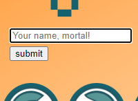
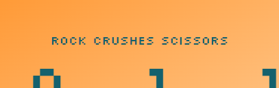
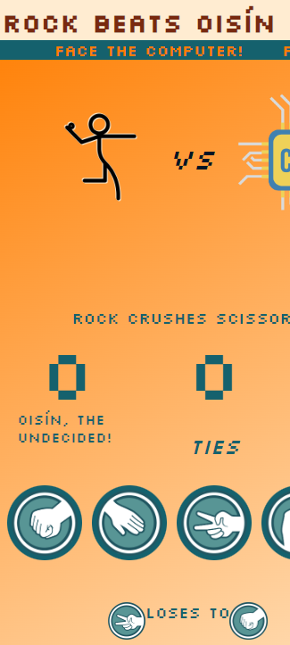
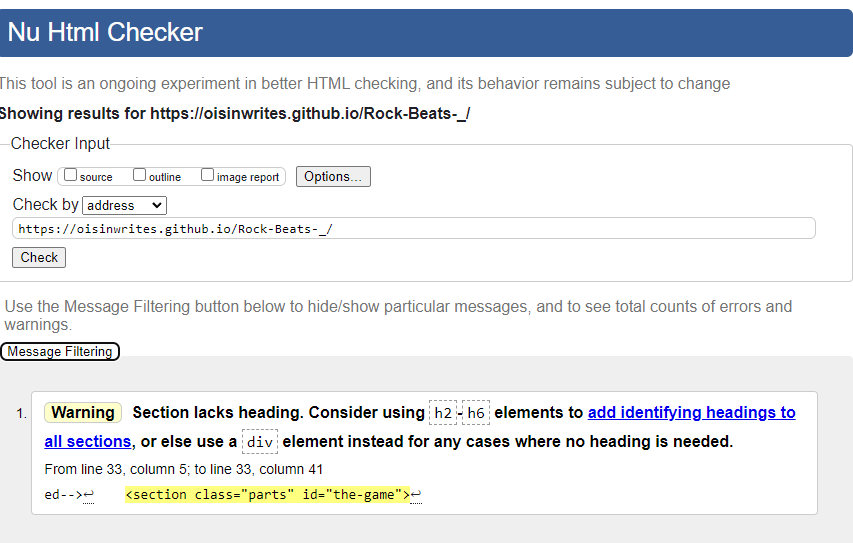
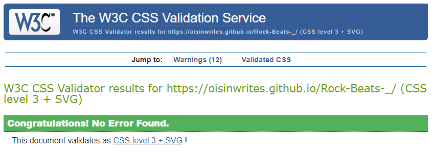
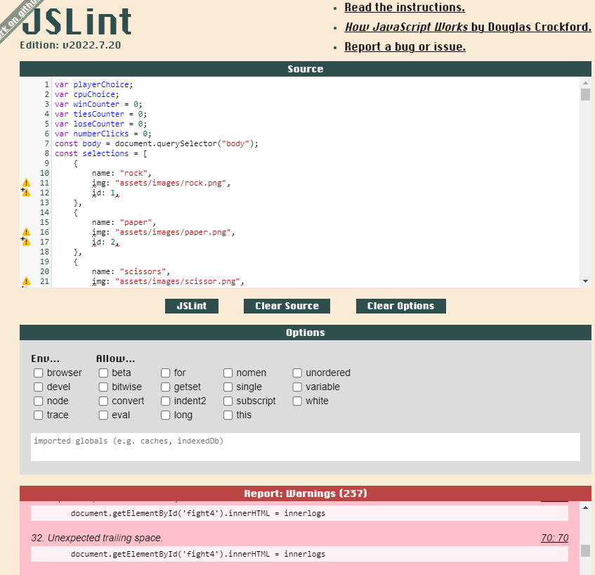
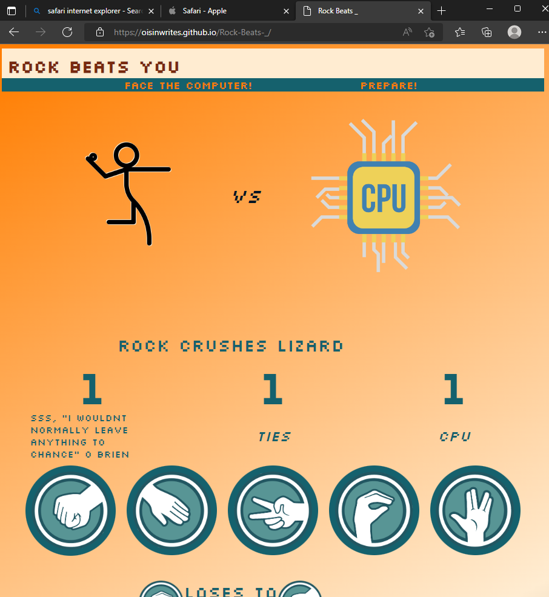
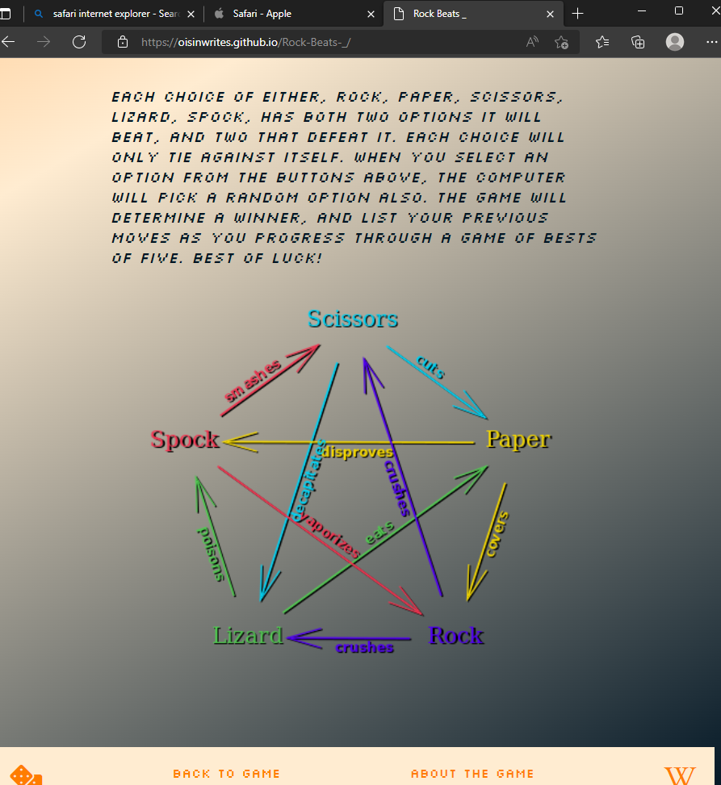
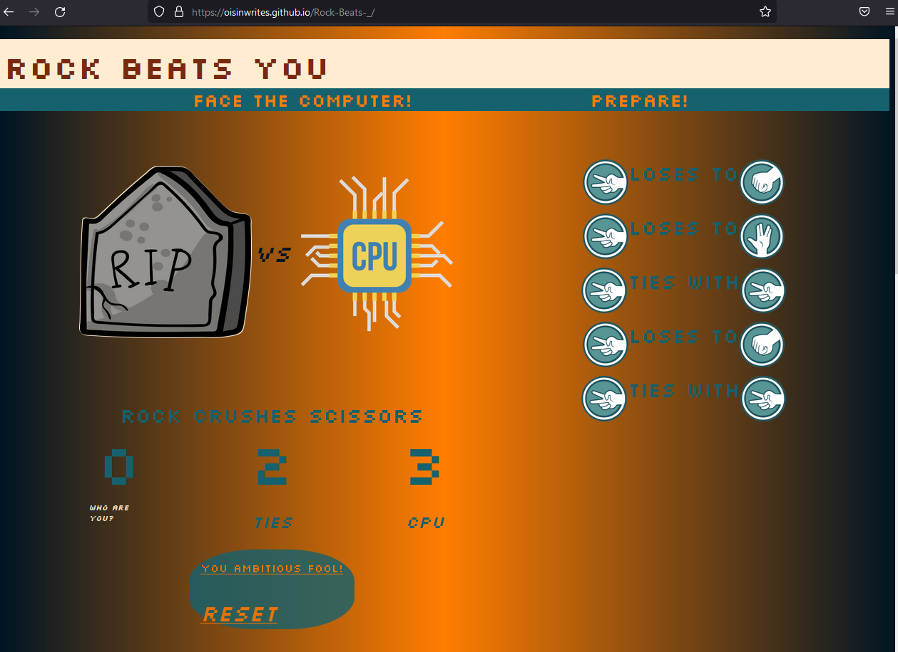
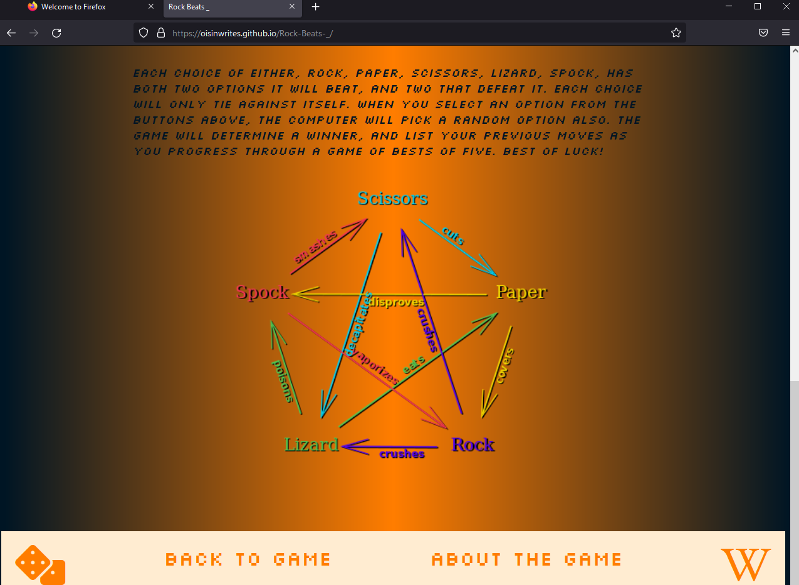

# Purpose of Site
- This site is place to play a version of the Rock, Paper, Scissors game
- It is expanded to include the variables of Lizard and Spock, created and popularised by
- the sitcom 'The Big Bang Theory'.
- The site must be attractive and well laid out. 
- It must have instruction on how the game is played, and a scoring system.

# Features
- The site will have interactive buttons that give the user feedback based on their choice.
- 
- The player will be able to play against the computer, which will be able to randomly select a choice.
- The player will see a record of past moves, their current score of best of 5.
- The player should be able to enter their player name.
- 
- The site should replace the player name submission form with the players name, and an automated title.
- Such as *Oisín, the Oblivious!*.
- 
- In the record of past moves the latest choices should appear at the top of the list.
-  
- The record of past choices should reset after each best of three.
- In the record of past moves the relationship between various choices should show.
-   Such as 'Rock' *crushes* 'Scissors'.
- 
- If in any case the player loses to the computer by a choice of rock, the players name could appear in the banner, such as 'Rock Beats _' => 'Rock Beats Oisín'.
- 
- Choices that the computer ties against will have their own seperate counter.
- 
- Stickman avatar changes to a tombstone or a hero depending on win or lose, and reverts back on reset button click.
- 
- 
## Error log
- Stylesheet having no effect on server output
    Recreated stylesheet, rewrote link, rewrote ids in css.
    Resolved finally by add/push/commit/sync

- JS not updating changes in browser
    add/push/commit/sync and restarting python3 -m http.server command not resolving
    exiting git pod and reloading resolved

- Console log shows that click event not tying into global choice vars
    Resolution: in event, calling on function 'makeChoice' should have been reapplied
    to the new const of 'choice' which pulls the data from old const of 'choiceName'

- Console log shows that the cpuChoice is not being acknowledged in click event
    Added return of choices
    Resolved. console log shows random choice for each click of 'rock'

- Chart with record of past moves not working
    Saving and restarting
    Solution found: needed square brackets over html identifier in js script

- Record of choices issues
 
- Rock can't win against second opponent, 'Lizard'.
    Tried making 2 beats in list. Tried making second rock global element that only beats lizard
    Going to make beats 2 and treat as beats
    Resolved, not by treating exactly the same but by use of an 'or' statement, ||, at same place.

- Second charts issue: computers winning choices aren't showing as having beaten player
    No idea how this was resolved other than through workshopping the next issue, and it  seems to inadvertently fixed the issue.

- Third issue: record flowing out to right of page endlessly.
    Changed back to divs and content is going down the page, but need to limit times
    Also need both choices to appear along side, not one after the other as is happening
    Now appearing alongside- moved js keyword 'record-choices-chart' into last child span of its original div, allowing the div styling to target it as its child.
    Continued to not work. Long Fix!
            JS code replacing innerHTML would replace the inner with new followed by old
            as one single innerHTML into one singular replaced div.
            Instead I made 5 divs, stacked from 5 -> 1 with
            the function imgToLog replacing innerHTML for each based on
            the numberClicks counter.
            And then used styling on the same divs the function targets to successfully
            center content with justify. 

- Game ends and restarts on 5th go
    Shouldn't restart but instead create a restart button, which itself sets counters to 0
    Made the restart button replace the selection moves buttons, and on click, reappear them.

- Button clicks caused cpuChoice to select random no 5 times, instead of just random of. thus 5 x 5
    tidied code within button event

- Changing Player 1 to a form on click is only allowed input into form with permanent click.
    Perhaps clicking into form to use it is creating a new form each time.
    This was part of the issue and to circumvent it, one div has a click event
    which changes a different div below that has no event listener.
    *gave up on making the input field its own submit button*

- Trying to create a form that saves its input to a var. After countless attempts
    I've found the correct method. Documented below.
-    "*form id="player-name-form">*
    *input type="text" name="nickname" placeholder="Your name, mortal!" id="player-name">*
    *input type="button" name="submit" onclick="onSubmit()" value="submit"*></form>*"

- Best of five paragraph not returning on reset 
    Issue with the innerHTML text not replacing "best of five"
    Fixed now.

### Errors Remaining
- input form for player name is too long and needs to be shortened, I believe it can
- be achieved with bootstrap. It is being left as is for submission.`

## Credits and Sources
- StackOverflow. An example of random selection: https://stackoverflow.com/questions/4959975/generate-random-number-between-two-numbers-in-javascript 
- Coolers. Colour palette generator. https://coolors.co/palette/001524-15616d-ffecd1-ff7d00-78290f
- StackOverflow. To get the form input type=text to submit on press enter key https://stackoverflow.com/questions/4418819/how-to-submit-a-form-on-enter-when-the-textarea-has-focus

## Testing

### HTML Validation
- 

### CSS Validation
- 
### javaScript Validation
- 
### Media Screen Mock-ups for Responsivity
- 
### Wave Accessibility Testing
- 
### Lighthouse Performance Testing
- 
### Alternate Browser Testing
- Safari 
- 
- 

- Firefox
- 
- 

- Chrome
    Website was tested from beinning to end using chrome